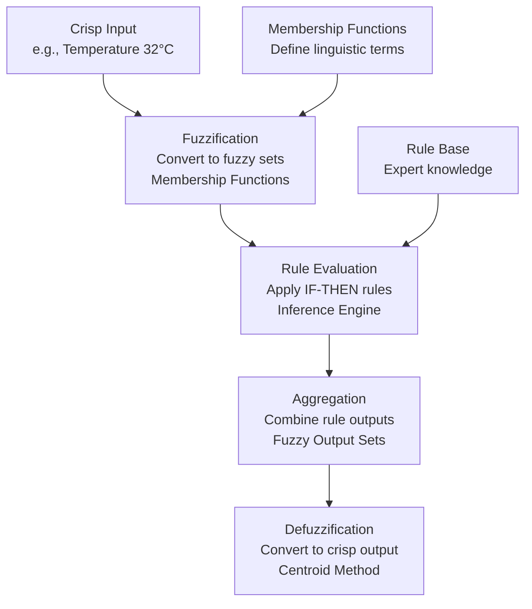
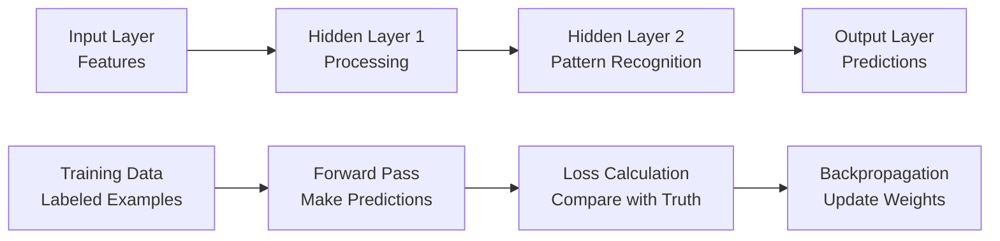

# Executive Summary

This comprehensive comparison explores the fundamental differences between fuzzy logic and neural networks, two distinct approaches to artificial intelligence. While both technologies aim to handle complex real-world problems, they operate on entirely different principles and excel in different domains.

**Key Insights:**
- **Fuzzy Logic** excels in interpretable, rule-based systems requiring human expertise
- **Neural Networks** dominate in pattern recognition tasks with large datasets
- **Complementary Technologies** that work together in hybrid neuro-fuzzy systems
- **Different Origins** with fuzzy logic emerging from control theory and neural networks from biological inspiration

# The Chef vs. The Recipe Tester: A Practical Analogy

Understanding the core difference between these two AI approaches can be illuminated through a simple culinary analogy.

## Fuzzy Logic: The Master Pastry Chef
- Uses nuanced, human-like judgment: "If the top is *mostly* golden brown, and the center is *slightly* springy, and a toothpick comes out *almost* clean, then the cake is *very probably* done"
- Relies on qualitative rules and expert knowledge rather than extensive data
- Excels at handling imprecision and uncertainty in decision-making

## Neural Networks: The Recipe Testing Team
- Learns through extensive training on thousands of cake examples
- Discovers hidden patterns in data that correlate with perfect baking results
- Makes predictions based on learned statistical relationships rather than explicit rules

# Core Concepts and Definitions

## What is Fuzzy Logic?

Fuzzy Logic is a mathematical approach to reasoning that deals with **approximate rather than fixed and exact** values. It extends classical Boolean logic to handle concepts like "partially true" or "very true."

### Fundamental Principles
- **Multi-valued Logic:** Truth values range between 0 and 1, not just true/false
- **Linguistic Variables:** Uses human-readable terms like "warm," "hot," "very hot"
- **Human-like Reasoning:** Mimics how people think and make decisions under uncertainty

### Key Components
1. **Fuzzification:** Converting precise numerical inputs into fuzzy sets with membership degrees
2. **Rule Base:** Human-defined IF-THEN rules that capture expert knowledge
3. **Inference Engine:** Applying rules to fuzzy inputs to generate fuzzy outputs
4. **Defuzzification:** Converting fuzzy outputs back to precise numerical values

## What is a Neural Network?

A Neural Network is a computing system inspired by biological neural networks, designed to recognize patterns and learn from data through interconnected nodes (artificial neurons).

### Fundamental Principles
- **Learning from Data:** Discovers patterns through exposure to examples rather than explicit programming
- **Connectionism:** Intelligence emerges from the strength of connections between nodes
- **Statistical Learning:** Uses mathematical optimization to minimize prediction errors

### Key Components
1. **Input Layer:** Receives raw data or features
2. **Hidden Layers:** Process information through weighted connections
3. **Output Layer:** Produces predictions or classifications
4. **Training Algorithm:** Adjusts connection weights to improve performance

# Detailed Comparison

| Feature | Fuzzy Logic | Neural Networks |
|---------|-------------|-----------------|
| **Core Principle** | Modeling human reasoning and imprecision | Learning from data patterns |
| **Knowledge Source** | Human expertise and rules | Historical data and examples |
| **Transparency** | High - rules are interpretable | Low - often "black box" systems |
| **Best Applications** | Control systems, expert systems, noisy data | Pattern recognition, prediction, classification |
| **Learning Ability** | None - rules manually defined | High - learns automatically from data |
| **Data Requirements** | Low - needs expert knowledge | Very High - requires large datasets |
| **Interpretability** | Excellent - rules are human-readable | Poor - internal workings often opaque |
| **Handling Uncertainty** | Excellent - designed for imprecision | Good - through probabilistic methods |

# Historical Development

## The Origins of Fuzzy Logic

### Foundational Work (1960s-1970s)
- **1965:** Lotfi Zadeh publishes "Fuzzy Sets" at UC Berkeley, introducing the concept of partial membership
- **Theoretical Development:** Early work focuses on mathematical foundations and challenging traditional set theory
- **Academic Criticism:** Traditional mathematicians initially dismiss fuzzy logic as "unscientific"

### Commercial Breakthrough (1980s-1990s)
- **Japanese Adoption:** Japanese engineers embrace fuzzy logic for practical applications
- **Consumer Products:** Hitachi subway systems, Matsushita appliances, Canon cameras
- **Industrial Success:** Validates fuzzy logic through real-world performance improvements

### Modern Applications (2000s-Present)
- **Embedded Systems:** Washing machines, air conditioners, automotive systems
- **Control Systems:** Anti-lock brakes, temperature control, industrial automation
- **Decision Support:** Medical diagnosis, financial systems, risk assessment

## The Evolution of Neural Networks

### Early Foundations (1940s-1960s)
- **1943:** McCulloch and Pitts create mathematical model of biological neurons
- **1958:** Rosenblatt develops the Perceptron, the first learning neural network
- **Initial Excitement:** Early promise in pattern recognition tasks

### First AI Winter (1969-1980s)
- **1969:** Minsky and Papert prove limitations of single-layer perceptrons
- **Funding Cuts:** "AI Winter" reduces research support and interest
- **Theoretical Work:** Continued development of multi-layer network concepts

### Renaissance and Modern Era (1980s-Present)
- **1980s:** Backpropagation algorithm enables training of deep networks
- **1990s-2000s:** Steady progress with new architectures (CNNs, RNNs)
- **2010s-Present:** Deep Learning Revolution driven by big data, GPUs, and improved algorithms

# Technical Deep Dive: Fuzzy Logic Architecture

## The Fuzzy Inference System (FIS)

A Fuzzy Logic system processes information through a structured four-step approach:

## Step-by-Step Process Explanation

### 1. Fuzzification Process
**Input:** Precise numerical value (e.g., 32°C)  
**Process:** Evaluate input against all membership functions  
**Output:** Degrees of membership in each linguistic category

**Example:**
- "Cold" membership: 0.0
- "Warm" membership: 0.4
- "Hot" membership: 0.8

### 2. Rule Evaluation (Inference)
**Process:** Apply fuzzy rules using logical operators (AND, OR)  
**Example Rules:**
- IF temperature is Cold THEN power is Low
- IF temperature is Warm THEN power is Medium
- IF temperature is Hot THEN power is High

**Rule Firing:**
- Rule 1: 0.0 × Low = 0% contribution
- Rule 2: 0.4 × Medium = 40% contribution
- Rule 3: 0.8 × High = 80% contribution

### 3. Defuzzification Methods
**Centroid Method:** Calculates center of gravity of combined output sets
**Bisector Method:** Finds vertical line that splits area into two equal parts
**Mean of Maximum:** Uses average of maximum membership values

## Neural Network Architecture

### Basic Structure

### Learning Process
1. **Forward Pass:** Input flows through network to generate prediction
2. **Loss Calculation:** Compare prediction with actual result
3. **Backward Pass:** Error signals flow backwards to update connection weights
4. **Weight Update:** Adjust all connections to reduce future errors

# Practical Applications and Use Cases

## Where Fuzzy Logic Excels

### Control Systems
- **Anti-lock Braking Systems (ABS):** Smooth brake pressure modulation
- **Air Conditioning:** Intelligent temperature and humidity control
- **Washing Machines:** Optimal wash cycles based on fabric and dirt level

### Expert Systems
- **Medical Diagnosis:** Handling uncertain symptoms and patient conditions
- **Financial Risk Assessment:** Evaluating loans with imprecise criteria
- **Industrial Process Control:** Managing complex manufacturing variables

## Where Neural Networks Dominate

### Pattern Recognition
- **Image Classification:** Identifying objects in photos and videos
- **Speech Recognition:** Converting audio to text
- **Fraud Detection:** Identifying suspicious financial transactions

### Predictive Analytics
- **Stock Market Forecasting:** Predicting price movements
- **Weather Prediction:** Complex atmospheric modeling
- **Recommendation Systems:** Suggesting products and content

# Hybrid Systems: The Best of Both Worlds

Modern AI systems often combine both approaches to leverage their complementary strengths.

## Neuro-Fuzzy Systems

### Architecture
- **Neural Network Component:** Learns fuzzy rules and membership functions from data
- **Fuzzy Logic Component:** Provides interpretable reasoning framework
- **Combined Benefit:** Automatic learning with human-understandable explanations

### Applications
- **Adaptive Control:** Systems that learn and explain their behavior
- **Intelligent Decision Support:** Medical diagnosis with reasoning transparency
- **Quality Control:** Manufacturing systems that learn from experience and explain decisions

## Example: Neuro-Fuzzy Trading System
- **Neural Network:** Predicts market trends from historical price data
- **Fuzzy Logic:** Makes trading decisions based on prediction confidence, risk level, and market conditions
- **Combined System:** "IF prediction confidence is HIGH AND risk is MEDIUM THEN invest LARGE amount"

# The Future: Convergence and Collaboration

## Current Trends
- **Hybrid Systems:** Increasing integration of fuzzy logic and neural networks
- **Explainable AI:** Fuzzy logic's interpretability addresses neural network "black box" concerns
- **Edge Computing:** Fuzzy logic's low computational requirements suit resource-constrained devices

## Emerging Applications
- **Autonomous Vehicles:** Neural networks for perception, fuzzy logic for decision-making
- **Smart Cities:** Combined approaches for traffic management and resource optimization
- **Healthcare AI:** Neural networks for diagnosis, fuzzy logic for treatment planning

## Research Directions
- **Adaptive Neuro-Fuzzy Systems:** Self-tuning fuzzy systems using neural learning
- **Deep Fuzzy Learning:** Integrating fuzzy logic into deep learning architectures
- **Quantum Fuzzy Systems:** Exploring fuzzy logic in quantum computing contexts

# Conclusion: Complementary Technologies

Fuzzy Logic and Neural Networks represent two fundamentally different approaches to artificial intelligence, each with distinct strengths and ideal applications. Rather than competitors, they serve as complementary technologies that, when combined, offer the best of both worlds: the learning power of neural networks and the interpretability of fuzzy logic.

The future lies not in choosing one over the other, but in developing increasingly sophisticated hybrid systems that leverage the unique advantages of both approaches to solve complex real-world problems more effectively than either could alone.

---
*Researched on DeepSeek*