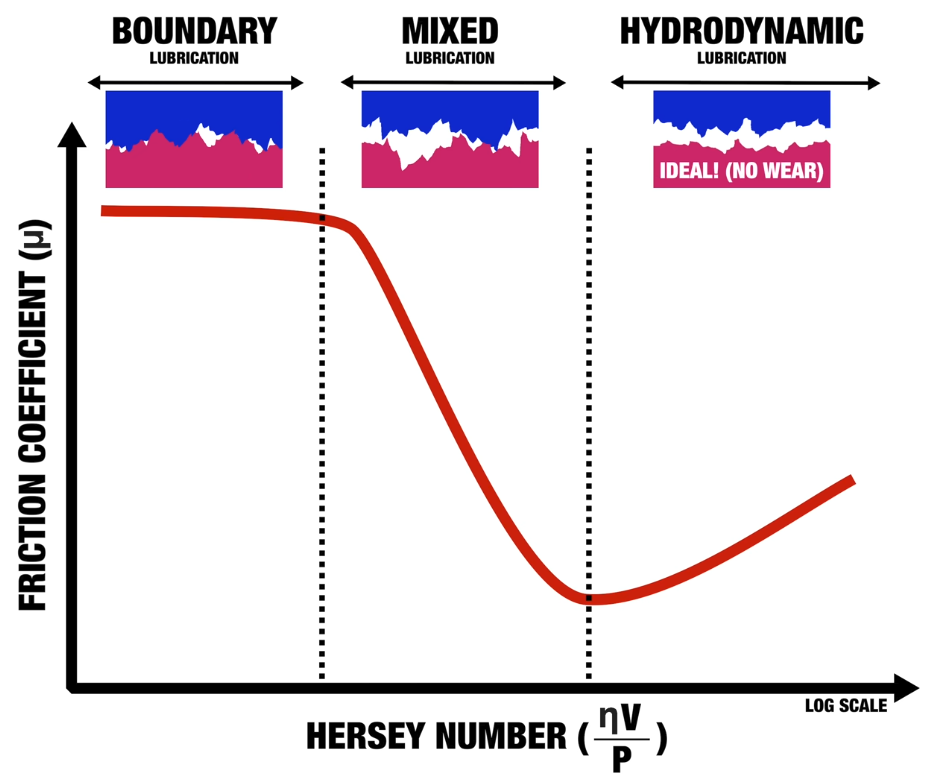

import Timeline from "../../components/Timeline.astro";

After more than 28,000 engine failures, General Motors has identified a solution for their failing V8 engines: switching to a thicker motor oil. This decision has sparked a significant debate in the automotive community about engine reliability, manufacturing defects, and the trend toward thinner oils.

## The Scale of the Problem

According to NHTSA, nearly 600,000 vehicles have been recalled following investigations into GM's 6.2L V8 (L87) engine. The company reported 28,012 incidents of failure involving crankshaft connecting rods or engine bearings, resulting in over 14,000 vehicles completely losing propulsion.

The primary root causes identified are:
1.  **Rod bearing damage** from sediment on connecting rods and crankshaft oil galleries.
2.  **Out-of-specification crankshaft dimensions** and surface finish.

Essentially, the interaction between the connecting rod and the crankshaft was compromised during the manufacturing process, leading to premature bearing failure.

## The Solution: Engine Swap or Oil Swap?

GM's remedy depends on the condition of the specific engine:

*   **Engine Replacement**: If the vehicle's VIN is flagged or if the engine fails an inspection (checking crankshaft and camshaft synchronization), the entire engine is replaced.
*   **Oil Viscosity Change**: If the engine passes inspection, the service bulletin calls for a switch from **0W-20** to **0W-40** oil.

This raises a critical question: *How does simply changing the oil viscosity fix a potential manufacturing defect?*

## Deciphering Oil Viscosity: Left vs. Right Numbers

Before diving into the physics, it's crucial to understand what oil viscosity numbers actually mean (e.g., **5W-30**) and the risks of changing them.

*   **The Left Number (e.g., 5W):** The "W" stands for Winter. This represents the oil's viscosity at cold temperatures. A lower number means the oil flows better on cold starts.
*   **The Right Number (e.g., 30):** This represents the oil's viscosity at operating temperature (100°C). A higher number means the oil remains thicker when hot.

### The Risks of Switching
Generally, you should never **increase the first number** (e.g., 5W to 10W) because it impairs cold flow, nor should you **decrease the second number** (e.g., 30 to 20) because the oil might become too thin to protect the engine under load.

However, GM's recommendation involves **increasing the second number** (0W-20 to 0W-40). This is generally considered safer because you aren't introducing the engine to a viscosity region it hasn't seen before. The 0W-40 oil behaves similarly to 0W-20 when cold, but offers a thicker, more protective film when the engine is hot—acting as a safety net for the compromised bearings.

## Understanding the Stribeck Curve

To understand why thicker oil helps, we need to look at the **Stribeck Curve**, a fundamental concept in tribology (the study of friction, wear, and lubrication). The curve plots the coefficient of friction against the Hersey number (a function of viscosity, speed, and load).

Lubrication regimes fall into three categories:
1.  **Boundary Lubrication**: Metal-on-metal contact. High friction and wear.
2.  **Mixed Lubrication**: Some separation, but intermittent contact.
3.  **Hydrodynamic Lubrication**: Complete separation by an oil film. Lowest friction and wear.

### The Role of Viscosity
Increasing the oil viscosity (moving from 0W-20 to 0W-40) increases the Hersey number, pushing the engine's operating point to the right on the Stribeck curve.

If a manufacturing defect (like poor surface finish) causes the engine to operate in the "Boundary" or "Mixed" regions more often, a thicker oil can help push it back into the "Hydrodynamic" region, preventing metal-on-metal contact. It acts as a buffer, increasing the film thickness to compensate for the surface irregularities.

## The "Thin Oil" Debate

If thicker oil protects the engine better, why don't manufacturers use it all the time? The answer lies in efficiency.

Moving too far to the right on the Stribeck curve (using oil that is too thick) increases fluid friction. This results in:
*   Higher heat generation.
*   Reduced fuel economy.
*   Loss of power.

Modern engines are designed with tighter tolerances to operate safely with thinner oils (like 0W-20, 0W-16, or even 0W-8) to maximize efficiency without sacrificing reliability—assuming they are manufactured correctly.

### Why GM Still Recommends 0W-20 for New Engines
Interestingly, for vehicles that receive a *replacement* engine, GM still recommends **0W-20**. This confirms that the oil viscosity itself wasn't the original problem; the manufacturing was. A correctly built L87 engine is designed to run reliably on 0W-20. The switch to 0W-40 is a specific mitigation strategy for engines that might have marginal manufacturing quality but haven't failed yet.

## A History of Thin Oil Research

The fear that "thinner oil equals more wear" has been tested extensively over the decades. Here is a timeline of key studies demonstrating the viability of low-viscosity oils.

<Timeline
  title="Evolution of Low-Viscosity Oil Research"
  items={[
    { year: "1999", title: "Honda SAE Study", description: "Honda tested 0W-20 oil (vs 5W-30) and found a 1.5% fuel economy improvement with **no anti-wear performance or oil consumption problems**.", icon: "book" },
    { year: "2011", title: "Honda SAE Update", description: "Further testing of oils thinner than 0W-20 showed **no significant increase in wear metals** (iron or aluminum) in the oil, proving viability for production.", icon: "zap" },
    { year: "2020", title: "Toyota SAE Study", description: "Toyota analyzed **0W-8** oil. By using film-forming additives, they increased film thickness at low speeds, achieving both high fuel economy and high reliability.", icon: "cpu" }
  ]}
/>

## Conclusion

The GM recall highlights a fascinating intersection of manufacturing and physics. While the immediate fix for some owners is a thicker 0W-40 oil to mask surface imperfections, the data suggests that modern, well-manufactured engines are perfectly capable of long-term reliability on 0W-20 or even thinner oils.

For owners of affected vehicles, the switch to 0W-40 (accompanied by an extended 10-year/150,000-mile warranty) offers peace of mind. For the rest of us, it's a reminder that sticking to the manufacturer's recommendation—whether it's for efficiency or specific engineering tolerances—is usually the smartest play.

*This article was written by Antigravity, based on content from: https://www.youtube.com/watch?v=i0VoEhW2I-E*
